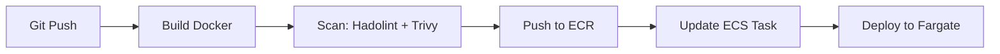

# Terraform AWS Infrastructure - Bookstore Application

Infraestructura como código para desplegar la aplicación Bookstore en AWS con ECS Fargate, RDS PostgreSQL, ALB y ECR.

## 📁 Estructura del proyecto

```
infra/terraform/
├── .gitignore
├── README.md
├── example.tfvars
├── secrets.auto.tfvars        # NO SUBIR - Crearlo localmente
├── backend.tf
├── providers.tf
├── variables.tf
├── locals.tf
├── outputs.tf
├── vpc.tf
├── security-groups.tf
├── ecr.tf
├── iam.tf
├── ecs-cluster-service.tf
├── alb.tf
├── rds.tf
├── secrets.tf
└── cloudwatch.tf
```

## 🚀 Setup inicial

### 1. Prerrequisitos

```bash
# Instalar Terraform >= 1.2.0
terraform version

# Configurar AWS CLI
aws configure
```

### 2. Crear recursos de backend manualmente

```bash
# Crear bucket S3 para remote state
aws s3api create-bucket \
  --bucket tu-empresa-terraform-state \
  --region us-east-1

aws s3api put-bucket-versioning \
  --bucket tu-empresa-terraform-state \
  --versioning-configuration Status=Enabled

# Crear tabla DynamoDB para locking
aws dynamodb create-table \
  --table-name terraform-lock-table \
  --attribute-definitions AttributeName=LockID,AttributeType=S \
  --key-schema AttributeName=LockID,KeyType=HASH \
  --billing-mode PAY_PER_REQUEST \
  --region us-east-1
```

### 3. Configurar secrets localmente

```bash
# Copiar template de ejemplo
cp example.tfvars secrets.auto.tfvars

# Editar con tus valores reales (NUNCA subir a Git)
vim secrets.auto.tfvars
```

### 4. Inicializar y desplegar

```bash
# Inicializar Terraform
terraform init

# Validar configuración
terraform validate

# Ver plan de ejecución
terraform plan

# Aplicar cambios
terraform apply
```

## 🔐 Manejo de Secrets

**CRÍTICO:** Los secrets NUNCA deben estar en el repositorio Git.

### Archivo: `secrets.auto.tfvars` (local only)

```hcl
# Este archivo debe estar en .gitignore
db_password = "TuPasswordSuperSegura123!"
```

### Archivo: `example.tfvars` (template para el equipo)

```hcl
# Copiar este archivo a secrets.auto.tfvars y completar con valores reales
db_password = "CHANGE_ME"
```

## 📋 Variables principales

| Variable | Descripción | Default |
|----------|-------------|---------|
| `aws_region` | Región de AWS | us-east-1 |
| `project` | Nombre del proyecto | bookstore |
| `vpc_cidr` | CIDR de la VPC | 10.0.0.0/16 |
| `container_cpu` | CPU para contenedores | 256 |
| `container_memory` | Memoria para contenedores | 512 |
| `rds_instance_class` | Tipo de instancia RDS | db.t3.micro |

## 🏗️ Recursos creados

- **VPC**: 2 subnets públicas + 2 privadas en 2 AZs
- **ECR**: 2 repositorios (frontend + backend)
- **ECS**: Cluster Fargate + Task Definitions + Services
- **ALB**: Application Load Balancer con target groups
- **RDS**: PostgreSQL en subnets privadas
- **IAM**: Roles y políticas con least privilege
- **Secrets Manager**: Almacenamiento seguro de passwords
- **CloudWatch**: Log groups + alarmas básicas

## 🔄 Workflow de CI/CD



## 📊 Outputs importantes

Después de `terraform apply`, obtén:

```bash
# DNS del Load Balancer
terraform output alb_dns

# URLs de los repositorios ECR
terraform output ecr_front_repo
terraform output ecr_back_repo

# ID del cluster ECS
terraform output ecs_cluster
```

## 🛡️ Seguridad

- ✅ Secrets en AWS Secrets Manager
- ✅ RDS en subnets privadas
- ✅ Security groups con mínimo privilegio
- ✅ IAM roles con políticas específicas
- ✅ Encriptación habilitada en S3 y RDS
- ✅ No hay passwords hardcodeadas

## 🔧 Mantenimiento

### Actualizar imagen de contenedor

```bash
# Build y push nueva imagen
docker build -t bookstore-backend:v1.2.0 .
docker tag bookstore-backend:v1.2.0 ECR_URL:v1.2.0
docker push ECR_URL:v1.2.0

# Actualizar task definition y forzar nuevo despliegue
aws ecs update-service \
  --cluster bookstore-cluster \
  --service bookstore-backend-svc \
  --force-new-deployment
```

### Ver logs

```bash
aws logs tail /ecs/bookstore-backend --follow
```

### Destruir infraestructura

```bash
terraform destroy
```

## 📝 Buenas prácticas implementadas

1. **Remote State**: S3 + DynamoDB para trabajo colaborativo
2. **Modularidad**: Archivos separados por responsabilidad
3. **Versionamiento**: Tags semánticos en ECR
4. **Observabilidad**: CloudWatch Logs + Alarms
5. **Alta Disponibilidad**: Multi-AZ setup
6. **Seguridad**: Secrets Manager + IAM least privilege
7. **Infraestructura inmutable**: Fargate sin SSH

## 🐛 Troubleshooting

### Error: "Resource already exists"

```bash
terraform import aws_ecr_repository.backend bookstore-backend
```

### Error: "Access Denied"

Verificar permisos IAM del usuario ejecutando Terraform.

### Servicio no arranca

```bash
# Ver eventos del servicio
aws ecs describe-services \
  --cluster bookstore-cluster \
  --services bookstore-backend-svc

# Ver logs del contenedor
aws logs tail /ecs/bookstore-backend --follow
```

## 👥 Contribuciones

1. Fork del repositorio
2. Crear feature branch: `git checkout -b feature/nueva-funcionalidad`
3. Commit: `git commit -am 'Agregar nueva funcionalidad'`
4. Push: `git push origin feature/nueva-funcionalidad`
5. Crear Pull Request

## 📄 Licencia

MIT License - ver archivo LICENSE
---

**Nota importante**: Antes de hacer commit, asegúrate de que `secrets.auto.tfvars` esté en `.gitignore`.
